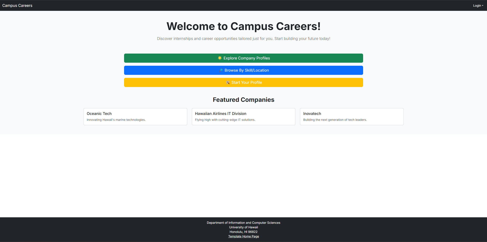
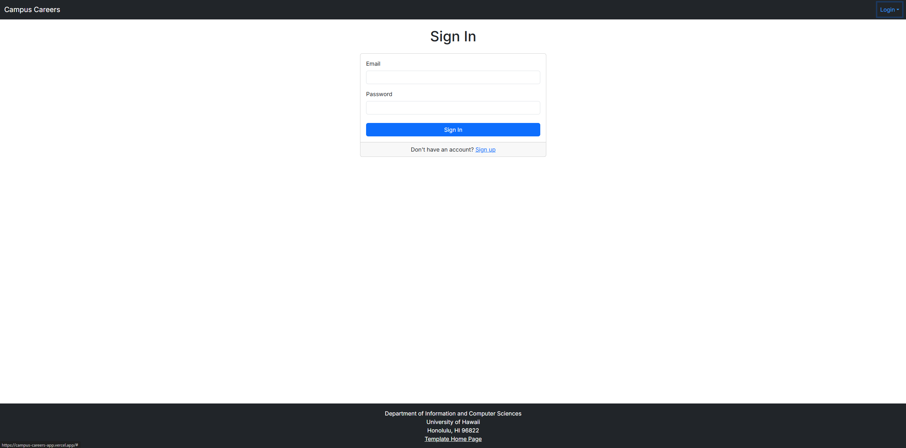
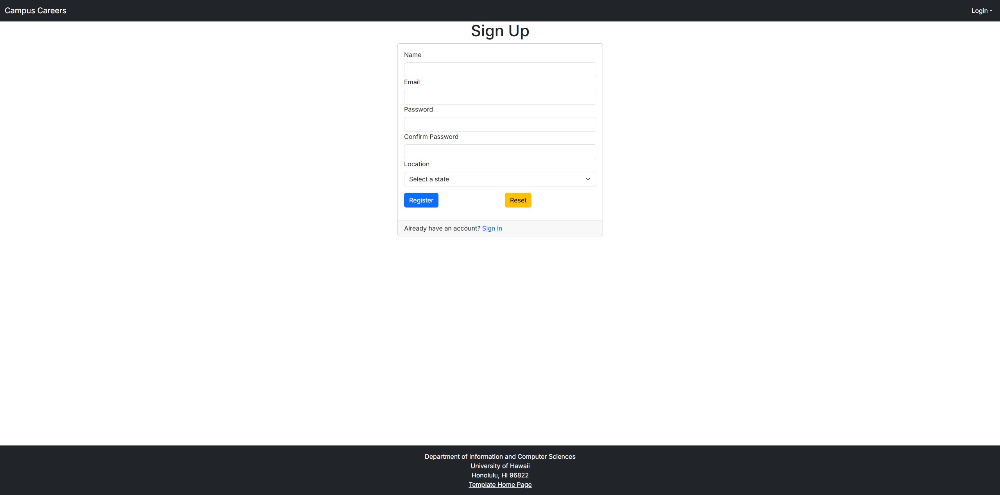
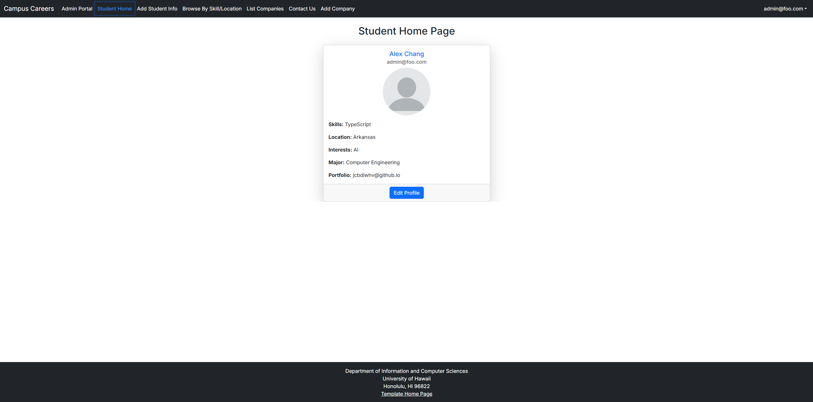
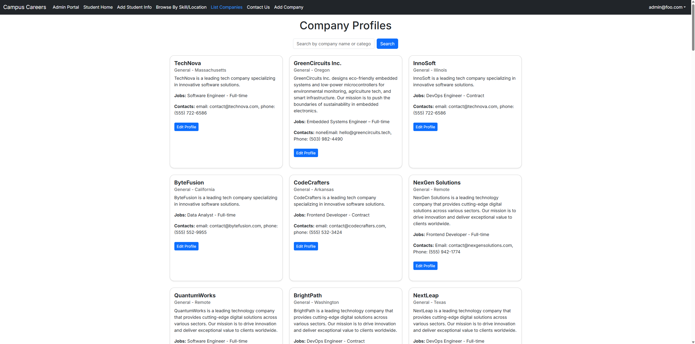
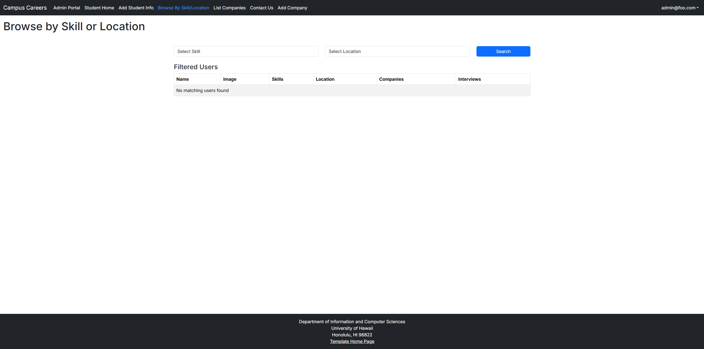
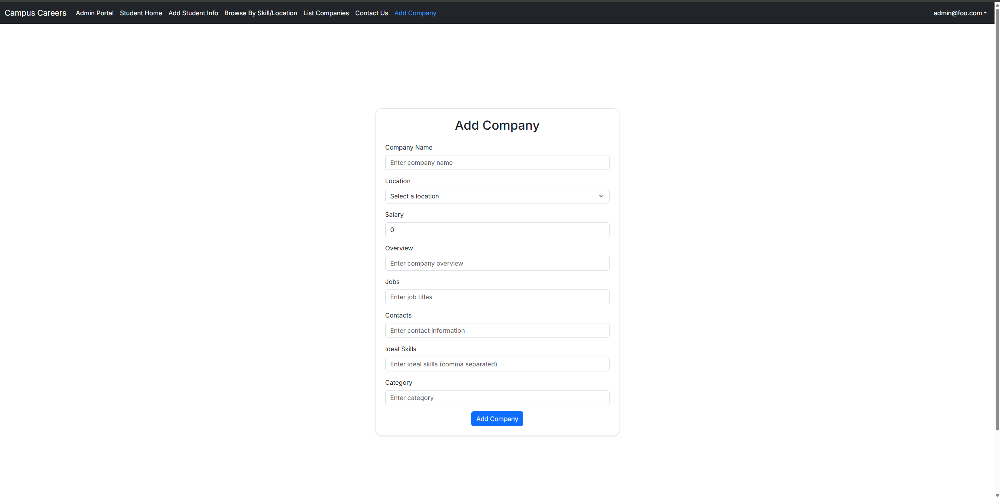
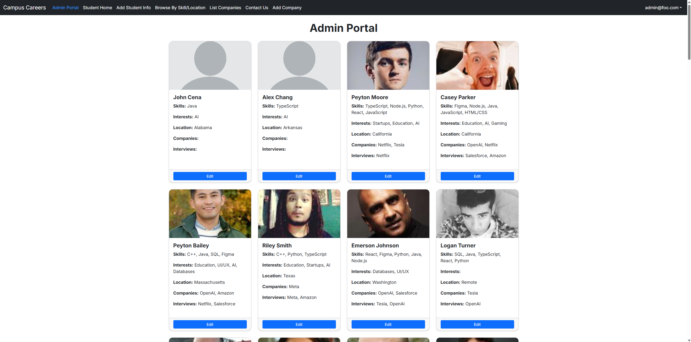

## Overview

Many UH Computer Science and Engineering students want to learn about internship and job opportunities, but currently, they must wait until a company reaches out with a visit or announcement. There is no centralized way for students to explore the landscape of opportunities and prepare in advance.

**Campus Careers** solves this by offering a new way for local and non-local companies to share potential opportunities with UH students. It also allows students to showcase their interests and get matched with companies looking for their skill sets.

## Team

- **Mason Lee**
  
- **Phoebe Chang**

- **Jayden Huynh**
  
- **Kristian Soares**

- **Alexander Chang**
 

## Goals

**The goal of Campus Careers is to:**

- Help companies promote internships and job opportunities to UH students in a more consistent, ongoing way.
- Allow students to create professional profiles with interests and skills.
- Match students and companies based on compatibility.
- Provide admins tools to moderate the site and manage skill/location categories.

## Features

- **Company Pages:**
  - Company overview
  - Location
  - List of commonly recruited positions with skills, type (internship/full-time), desired hires, and salary range
  - Contact info and links

- **Student Profiles:**
  - Skills and interests
  - Preferred location
  - Portfolio links

- **Admin Features:**
  - Monitor content
  - Manage skills and geographic categories

- **Search & Filter:**
  - Students and company matching

## User Guide

**Here are some early mockup pages (subject to change as development progresses):**

### 1. Landing Page


### 2. Login / Sign Up Page



### 3. Student Home Page


### 4. Company Listing Page


### 5. Browse Skill / Location Page


### 6. Create Company Page


### 7. Administration Edit Page


## Developer Guide: Setup
### CLONE THE REPOSITORY
Clone the repository to your local machine using Git.
```
git clone https://github.com/campus-careers/campus-careers-app.git
cd your-repo-name
```

### INSTALL DEPENDENCIES

Install Node.js and npm (if not already installed):
- Download for Windows/macOS: https://nodejs.org/en/download
- Ubuntu/Debian: ```sudo apt install nodejs npm```

Install PostgreSQL:
- Official download page (Windows/macOS/Linux): https://www.postgresql.org/download/
- Homebrew (Mac): ```brew install postgresql```
- Ubuntu/Debian: ```sudo apt install postgresql postgresql-contrib```

Make sure you have Node.js (v18+) and npm installed.
Then install the project's dependencies:
```
npm install
```

### SET UP THE ENVIRONMENT FILE

Create and configure your local environment file:
```
cp sample.env .env  # Use `copy sample.env .env` on Windows
```

Update the DATABASE_URL in the `.env` file:
```
DATABASE_URL=postgresql://<username>:<password>@localhost:5432/your-database-name?schema=public
```
Tip: If you don't have a PostgreSQL user yet, you can create one using:
```
createuser your-username --pwprompt
```
Then grant it access to the database if needed.


Copy the example environment file and edit it with your settings:
```
cp sample.env .env
```
Update the DATABASE_URL in the `.env` file:
```
DATABASE_URL=postgresql://<username>:<password>@localhost:5432/your-database-name?schema=public
```


### DATABASE SETUP (PostgreSQL + Prisma)

Make sure PostgreSQL is running locally before running these commands.
If you're using Windows and don't have CLI tools like `createdb`, consider using pgAdmin or DBeaver.


#### 1. Create the database:
```
createdb your-database-name
```
#### 2. Run migrations to set up tables:
```
npx prisma migrate dev
```

#### 3. Seed the database with sample data:
```
npx prisma db seed
```
Tip: Ensure that you have a valid seed file defined in `prisma/seed.ts` or `prisma/seed.js`.
If not set up, seeding will fail. See Prisma docs: https://www.prisma.io/docs/guides/database/seed-database
```
npx prisma db seed
```
### CODE LINTING AND FORMATTING

Run ESLint to check the codebase for errors and style issues.
This helps maintain code quality and consistency.
```
npm run lint
```

### STARTING THE DEVELOPMENT SERVER

This command runs the Next.js development server.
By default, it starts at `http://localhost:3000`
Open your browser and go to that URL to view the app.
```
npm run dev
```


### TESTING THE APPLICATION (Manual Verification)

To test if the app works:
1. Open a terminal.
2. Run the development server with `npm run dev`.
3. Open your browser and go to:
http://localhost:3000
4. Navigate through the app and verify the landing page and features are loading properly.


## Developer Guide: Prisma Schema
### Enums

* Role: Defines if a user is a USER or ADMIN
* Skill: Lists various programming languages, technologies, and other skills
* Locations: Represents various U.S. states and Remote as a location
    

### AdminList
Represents a list of administrative users with their contact and profile details.

#### Fields

* id: Auto-incremented unique identifier.
* email: Unique email address.
* name: Name of the admin.
* skills: List of skills associated with the admin.
* location: The location of the admin.
* interests: List of interests of the admin.
* image: URL or filename of the admin's image.
* interviews: List of interviews conducted by the admin.
* companies: List of companies managed or associated with the admin.


### Company
Represents a company or organization. This model holds details about the company, such as name, location, salary, and available jobs.

#### Fields

* id: Auto-incremented unique identifier.
* name: Unique name of the company.
* location: The company's location (from the Locations enum).
* salary: Salary offered by the company.
* overview: A brief overview of the company.
* jobs: List of available jobs in the company.
* contacts: Contact information for the company.
* idealSkill: List of skills that the company seeks in candidates.
* userId: Foreign key linking to the User who owns or is associated with the company.
* category: The category of the company (defaults to "General").

#### Relationships

* A Company belongs to a User (many-to-one relationship).


### ContactMessage
Represents a contact message sent by a user to the system. It includes the sender's name, email, and the message.

#### Fields

* id: Auto-incremented unique identifier.
* name: Name of the person sending the message.
* email: Email of the sender.
* message: The content of the message.
* createdAt: The timestamp when the message was created (defaults to now()).


### Filter
Represents a filter used to search or categorize users based on skills and locations.

#### Fields

* id: Auto-incremented unique identifier.
* skills: List of skills that are part of the filter.
* locations: Location where the user is located or searching for.


### Interview
Represents an interview between a student and a company. It includes details such as the date, company, and any notes.

#### Fields

* id: Auto-incremented identifier for the interview.
* date: The date of the interview.
* company: Name of the company conducting the interview.
* notes: Optional notes about the interview.
* studentId: Foreign key linking to the User (student).
* student: Relation to the User model (student).

#### Relationships

* Each Interview is associated with a single User (student) through studentId.


### Location
Represents a specific location. This model contains unique location names.

#### Fields

* id: Auto-incremented unique identifier.
* name: Unique name of the location.

#### Relationships

* Locations are used in User and Company models to represent the location of a user or company.


### SkillEntry
Represents a unique skill that can be associated with users, companies, or job listings.

#### Fields

* id: Auto-incremented unique identifier.
* name: The name of the skill (e.g., JavaScript, Python).


### Student
Represents a student profile in the system. It includes the student's name, skills, location, and other relevant details.

#### Fields

* id: Auto-incremented unique identifier.
* name: The student's name.
* email: Unique email address.
* skills: List of skills that the student possesses.
* image: URL or filename of the student's image.
* location: Location of the student.
* companies: List of companies the student is interested in.
* interviews: List of interviews the student has attended.
* interests: List of interests.
* major: The student's major (optional).
* portfolio: The student's portfolio URL (optional).


### User
Represents a user of the platform, which could be a student or an admin. A user can have multiple interviews, skills, interests, and more.

#### Fields

* id: Auto-incremented unique identifier.
* email: Unique email address.
* password: The user's password (hashed).
* role: Defines if the user is a USER or ADMIN.
* name: Name of the user.
* location: The location of the user (from the Locations enum).
* skills: List of skills related to the user (many-to-many relationship with Skill).
* interests: List of interests of the user.
* image: URL or filename of the user's image.
* major: The user's major (optional).
* portfolio: The user's portfolio URL (optional).
* companies: List of companies the user is associated with.
* interviews: List of interviews the user has participated in (one-to-many relationship with Interview).

#### Relationships

* A User can have multiple Interviews.
* A User can belong to multiple Companies.


## Community Feedback

#### Dora C.
- Observations: Worked on mobile, easy registration process
- Questions: Can I put dummy data in the form 
- Quotes: "Wow, you guys made this? Looks nice but I’m not looking for a job right now"
- Rating: 3.5/5

#### Mano C.
- Observations: can be navigated but slightly confusing wording??
- Questions: What is this even for..?
- Quotes: "You should put a direct contact form for students to companies"
- Rating: 4.5/5

#### Evan E.
- Observations: Worked on mobile
- Questions: 
- Quotes: "The registration is a little squished on mobile"
- Rating: 4/5

#### An S.
- Observations: easy to use and basic enough for any skill level
- Questions: How long did it take
- Quotes: "Very creative! Good job"
- Rating: 5/5

#### Schy V.
- Observations: works but not the cleanest in every browser
- Questions: How the search function should work?
- Quotes: "The search button is cutoff on my phone, I only see 'sea'"
- Rating: 4/5


## Use Cases

- A new user visits the landing page, logs in, and creates a profile.
- An admin logs in to review and manage categories and users.
- A student searches for companies that match their skillset and location preferences and reaches out.

## Advanced Feature Ideas

- Notification system via email or SMS.
- Activity tracking and analytics for companies.
- Enhanced filtering and personalized recommendations.

## About
**Campus Careers** is the final project for ICS 314, Spring 2025. It is developed using modern web technologies including Next.js, React, Bootstrap, and Prisma.

**For more information, contact:**

| **Name**        | **Email**              |
|-----------------|------------------------|
| Cam Moore       | cmoore@hawaii.edu      |
| Chad Morita     | chadmmm@hawaii.edu     |
| Dan Port        | dport@hawaii.edu       |
| Brook Conner    | dbconner@hawaii.edu    |

Information and Computer Sciences  
University of Hawaii  

## Developments
1. [Campus-Careers M1 Project Board](https://github.com/orgs/campus-careers/projects/1/views/1)
2. [Campus-Careers M2 Project Board](https://github.com/orgs/campus-careers/projects/2/views/1)  
3. [Campus-Careers M3 Project Board](https://github.com/orgs/campus-careers/projects/3)
3. [Campus Careers Application](https://campus-careers-app.vercel.app)
4. [Team Contract](https://docs.google.com/document/d/1xvUvAi_HGB6gElBEpcck0WA1tuJZAxd3U1V1imNmVtY/edit?usp=sharing)
---

Powered by the [Morea Framework](https://morea-framework.github.io) (Theme: spacelab)
