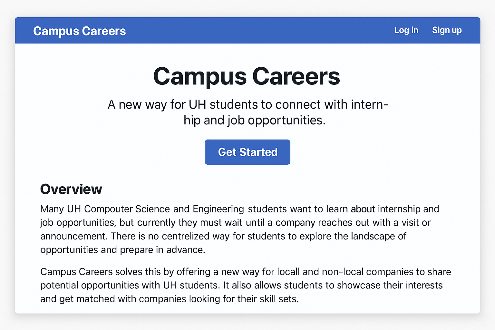
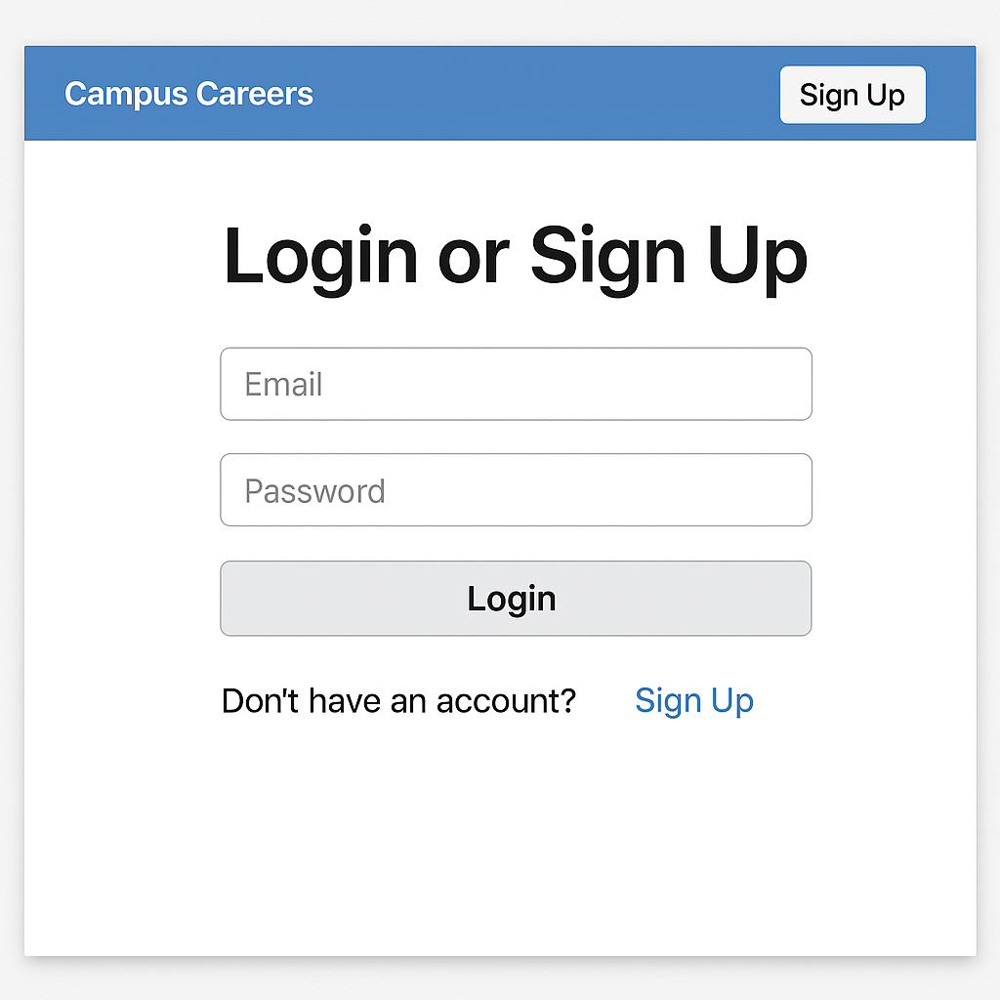
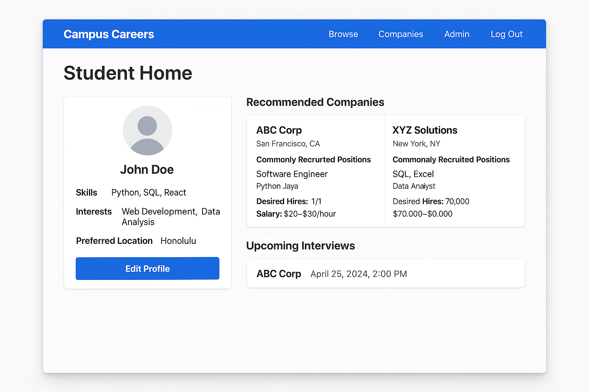
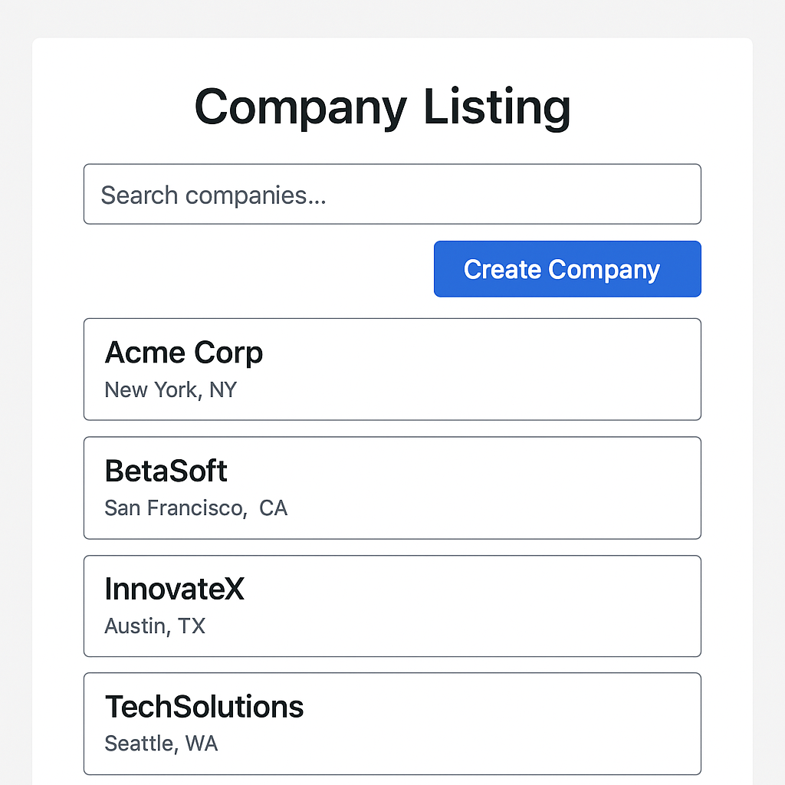
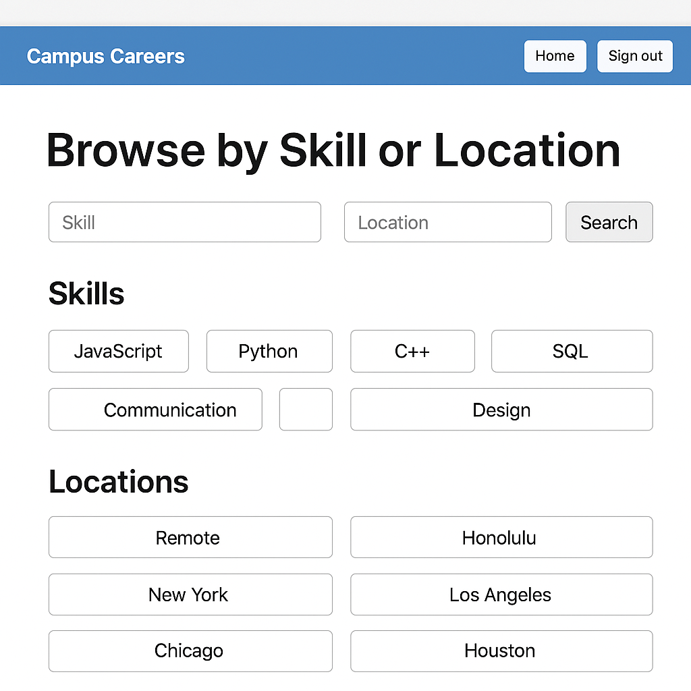
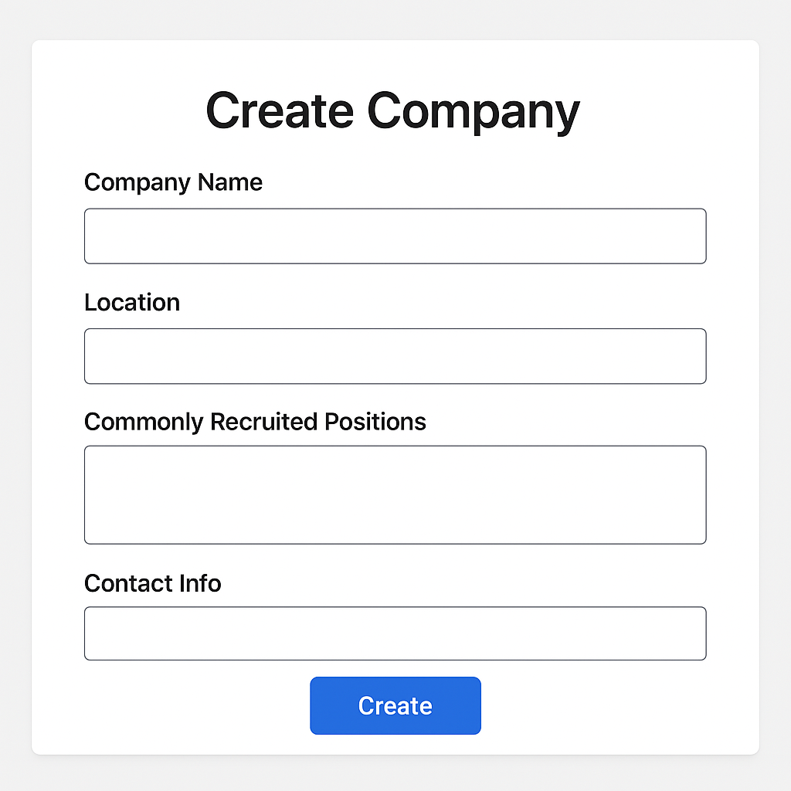
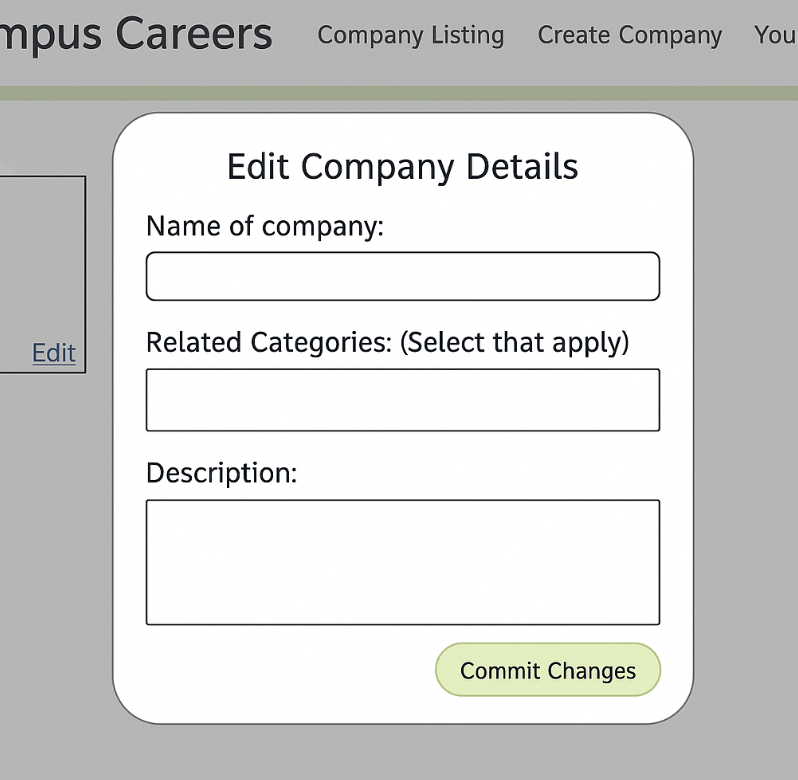
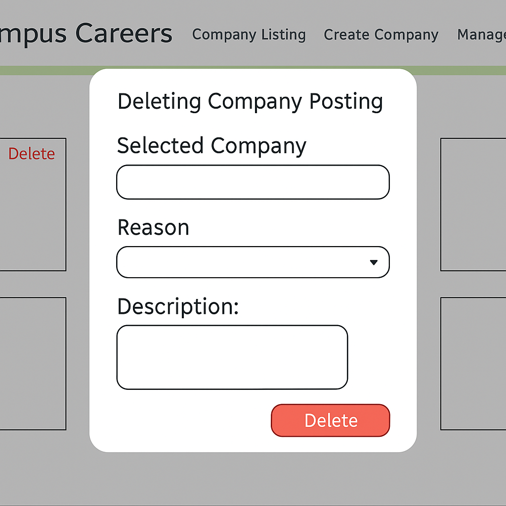

## Overview

Many UH Computer Science and Engineering students want to learn about internship and job opportunities, but currently, they must wait until a company reaches out with a visit or announcement. There is no centralized way for students to explore the landscape of opportunities and prepare in advance.

**Campus Careers** solves this by offering a new way for local and non-local companies to share potential opportunities with UH students. It also allows students to showcase their interests and get matched with companies looking for their skill sets.

## Team

- **Mason Lee**
  
- **Phoebe Chang**

- **Jayden Huynh**
  
- **Kristian Soares**

- **Alexander Chang**
 

## Goals

**The goal of Campus Careers is to:**

- Help companies promote internships and job opportunities to UH students in a more consistent, ongoing way.
- Allow students to create professional profiles with interests and skills.
- Match students and companies based on compatibility.
- Provide admins tools to moderate the site and manage skill/location categories.

## Features

- **Company pages with:**
  - Company overview
  - Location
  - List of commonly recruited positions with skills, type (internship/full-time), desired hires, and salary range
  - Contact info and links

- **Student profiles with:**
  - Skills and interests
  - Preferred location
  - Portfolio links

- **Admin features to:**
  - Monitor content
  - Manage skills/geographic categories

- **Search and filtering for matching students and companies**

## Mockups

**Here are some early mockup pages (subject to change as development progresses):**

### 1. Landing Page

### 2. Login / Sign Up Page

### 3. Landing Page (User)

### 4. Company Listing Page

### 5. Browse Skill / Location Page

### 6. Create Company Page

### 7. Administration Edit Page

### 8. Administration Delete Page

> _Note: All UI/UX mockups are in early development and will continue to evolve during the project._

## Use Cases

- A new user visits the landing page, logs in, and creates a profile.
- An admin logs in to review and manage categories and users.
- A student searches for companies that match their skillset and location preferences and reaches out.

## Advanced Feature Ideas

- Notification system via email or SMS.
- Activity tracking and analytics for companies.
- Enhanced filtering and personalized recommendations.

## About
**Campus Careers** is the final project for ICS 314, Spring 2025. It is developed using modern web technologies including Next.js, React, Bootstrap, and Prisma.

**For more information, contact:**

| **Name**        | **Email**              |
|-----------------|------------------------|
| Cam Moore       | cmoore@hawaii.edu      |
| Chad Morita     | chadmmm@hawaii.edu     |
| Dan Port        | dport@hawaii.edu       |
| Brook Conner    | dbconner@hawaii.edu    |

Information and Computer Sciences  
University of Hawaii  

## Developments
1. [Campus-Careers M1 Project Dashboard](https://github.com/orgs/campus-careers/projects/1/views/1)
2. [Campus Careers Application (Vercel Link Here) **NOT DONE YET**](https://your-vercel-link-here)
---

Powered by the [Morea Framework](https://morea-framework.github.io) (Theme: spacelab)
